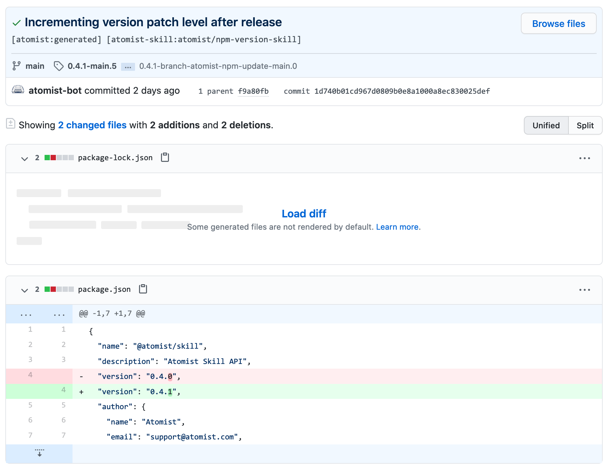

In a typical release flow for NPM packages, you will increment the patch level
of the package version after releasing. This skill facilitates the release flow
by automating the incrementing of the version patch level after release.

When a tag is pushed to a selected repository that looks like a release
[semantic version][semver], this skill checks out the current tip of the default
branch, increments the NPM package version patch level of the release version,
and then commits and pushes the change. If the version has already been
incremented, it does nothing.

[semver]: https://semver.org/ "Semantic Versioning"

### Increment version patch level after release

